# Project Specification: Markdown Reader

A complete, client-side **Markdown Reader** running entirely in the browser without any backend dependencies.

---

## 1. Executive Summary & Objective

**Objective:**  
To create an intuitive HTML5 web page where users can load local Markdown files (`.md`, `.markdown`, `.txt`) and read them in a clean, customizable, distraction-free environment. The application features robust document navigation, full-text search, code blocks with syntax highlighting, and multiple export formats.

---

## 2. Technical Architecture & Flow

The project is designed as a **100% frontend single-page application (SPA)** to ensure privacy, speed, and zero server maintenance.

### Data Flow Diagram
```text
[ Local File ]
      │
      ▼ (FileReader API)
[ Raw Markdown Text ]
      │
      ▼ (marked.js)
[ Raw HTML Content ]
      │
      ▼ (DOMPurify)
[ Sanitized HTML ] ───► [ Rendered Reading Environment ]
                               │
                               ├──► Sidebar Navigation (ToC)
                               ├──► Code Copy & Syntax Highlighting
                               ├──► Local Settings Persistence
                               └──► HTML/PDF Export
```

### Core Libraries
- **marked.js**: High-performance Markdown compiler.
- **DOMPurify**: Sanitization library to prevent Cross-Site Scripting (XSS).
- **highlight.js**: Code block detection and syntax highlighting.
- **mermaid.js**: Dynamic rendering of flowcharts and diagrams.

### Compilation & Distribution
- **Monoblock HTML**: The project build/compilation process must compile all files (HTML, CSS, JavaScript, and asset references) into a single, self-contained `index.html` file (monoblock) for effortless offline distribution and execution.

---

## 3. Detailed Feature Specifications

### 3.1 File Input & Handling
- **Formats Supported**: `.md`, `.markdown`, and `.txt` file uploads.
- **Drag & Drop**: Interactive drop zone on the landing screen.
- **Validation**: Client-side mime-type and extension validation.
- **Active State**: Displays the loaded file's metadata (name, size).
- **Reset Options**: A simple action button to load a different file.

### 3.2 Markdown Rendering Capabilities
- **Typography & Structure**: Headings, lists (ordered/unordered), tables, and horizontal rules (`---`).
- **Media**: Inline links and images.
- **Rich Elements**: Blockquotes, checklists, inline code, and code blocks.
- **Security**: Complete HTML sanitization using DOMPurify.

### 3.3 Personalized Reading Experience
- **Layouts**: Comfortable centralized layouts with a configurable maximum page width.
- **Typography Settings**: Switchable font-families (Serif vs. Sans-Serif), adjustable font size, and adjustable line spacing.
- **Visual Themes**: Dynamic Light and Dark modes.
- **Persistence**: Remembers theme preferences and layout scales across browser sessions using `localStorage`.

### 3.4 Navigation & Table of Contents (ToC)
- **Auto-Generation**: Dynamically parses the document headings (`h1`, `h2`, `h3`) to create a table of contents.
- **Layout**: Sticky sidebar menu listing sections.
- **Scrolling**: Smooth scrolling animation when navigating via the index.
- **Active States**: Highlights the current section of the document during scroll.

### 3.5 Document Search
- **Search Bar**: Accessible search field with real-time text matches.
- **Highlighting**: Visually marks matching terms inside the rendered content.
- **Indicators**: Matches counter (e.g., `3 of 10`).
- **Controls**: Next/previous buttons for quick navigation between search hits.

### 3.6 Code Block Utilities
- **Syntax Highlighting**: Real-time language styling via highlight.js.
- **Language Tags**: Displays the programming language name on the header of code blocks.
- **Quick Copy**: A floating "Copy code" button on every block.

### 3.7 Export & Print Options
- **HTML Export**: Download the sanitized, fully-rendered HTML document.
- **PDF Export**: Print-friendly layout styling using `window.print()` and custom print CSS.

### 3.8 Advanced Extras
- **Mermaid.js**: Renders diagrams and charts directly from markdown text blocks.
- **Presentation Mode**: Parses document pages based on horizontal rules (`---`) to generate responsive slides.
- **Shortcuts**: Basic keyboard hotkeys for navigation, theme toggle, and search.

---

## 4. Recommended Project Directory Structure

```text
markdown-reader/
├── index.html
├── README.md
├── css/
│   ├── style.css
│   ├── themes.css
│   └── print.css
└── js/
    ├── app.js
    ├── markdown.js
    ├── toc.js
    ├── search.js
    ├── settings.js
    ├── export.js
    └── presentation.js
```

---

## 5. Development Roadmap (Phased MVP Approach)

```mermaid
gantt
    title MVP Development Timeline
    dateFormat  X
    axisFormat %d
    section Phase 1: Core Base
    Upload & FileReader        :active, p1_1, 0, 2
    Markdown & Sanitization    :active, p1_2, after p1_1, 2
    section Phase 2: Reader Mode
    Theme & Visual settings    :p2_1, after p1_2, 3
    section Phase 3: Navigation
    Automatic ToC & Scrolling  :p3_1, after p2_1, 2
    section Phase 4: Productivity
    Search & Syntax Highlight  :p4_1, after p3_1, 3
    section Phase 5: Advanced
    Exports, Mermaid, Slides   :p5_1, after p4_1, 4
```



1. **Phase 1: Core Base**: File uploading, file reading, compiler setup, and initial page rendering.
2. **Phase 2: Reader Mode**: Theming (light/dark), adjustable typography, and custom page widths.
3. **Phase 3: Navigation**: Sticky sidebar generation and smooth scroll behaviors.
4. **Phase 4: Productivity**: Local document search, syntax highlighting, and "copy code" clipboard actions.
5. **Phase 5: Advanced Features**: Document exporting, Mermaid integration, and Presentation Mode.
